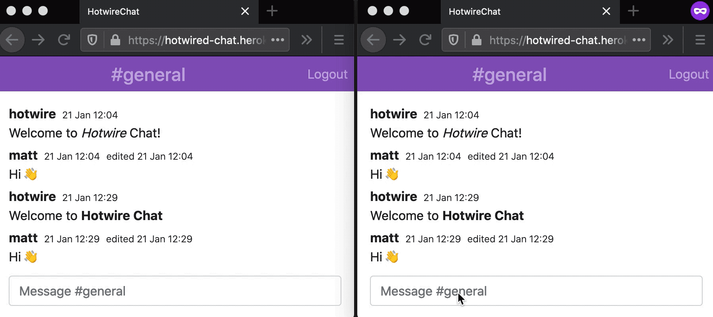
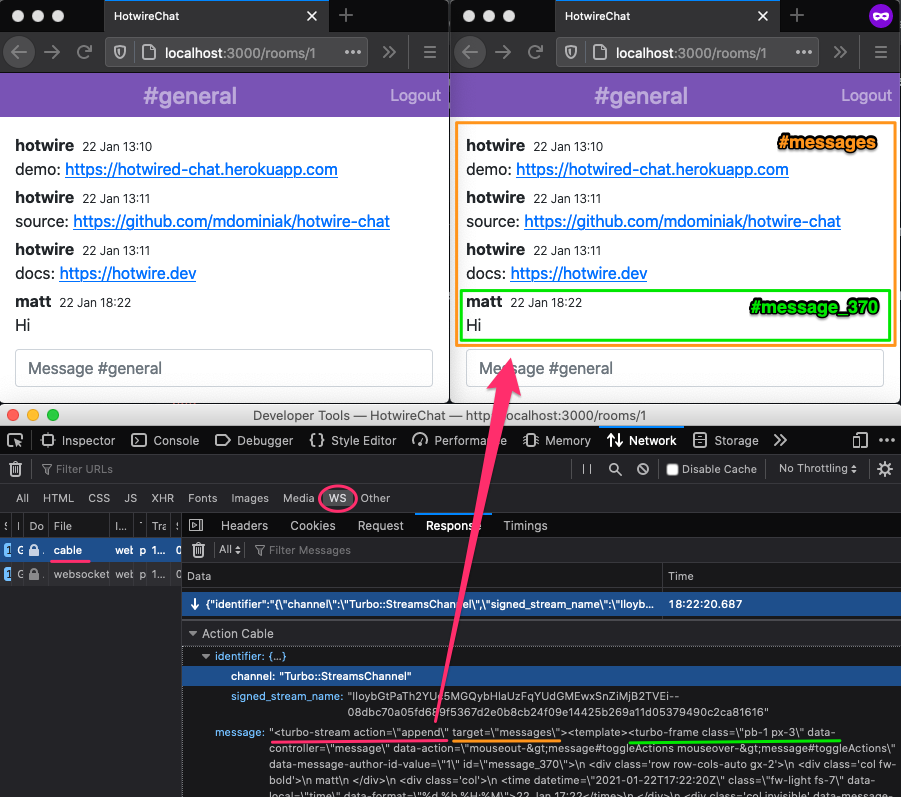
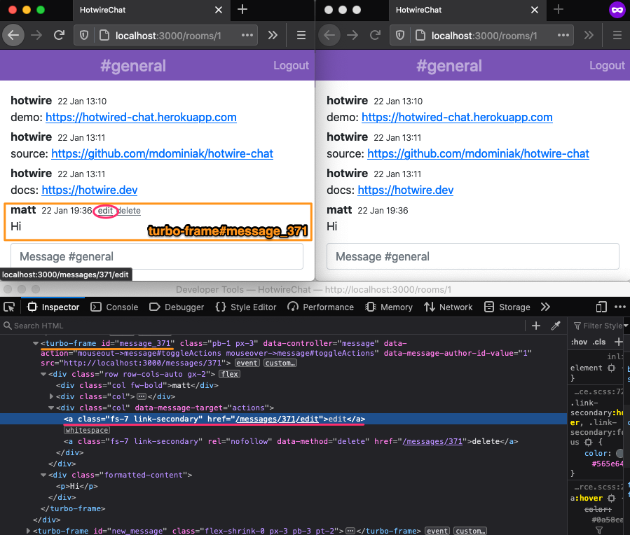
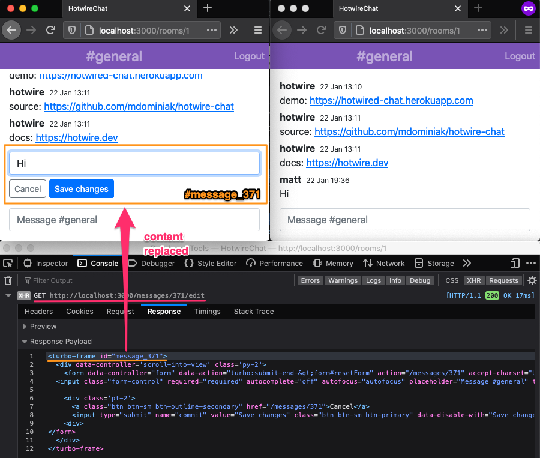
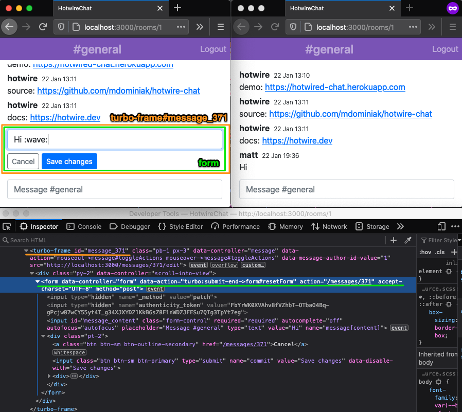
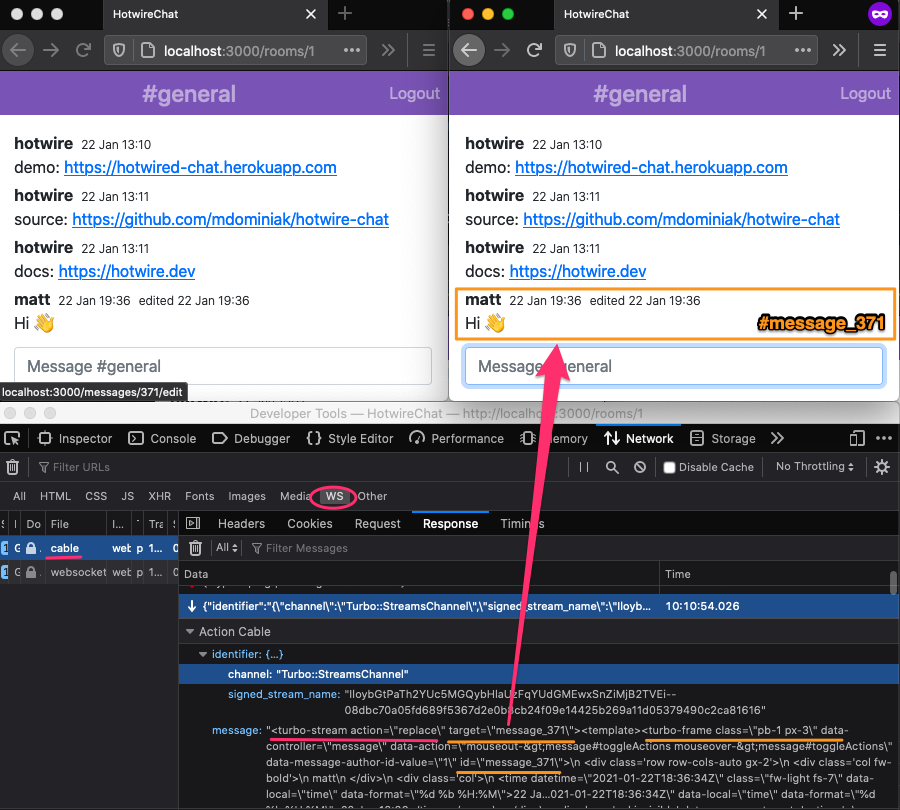
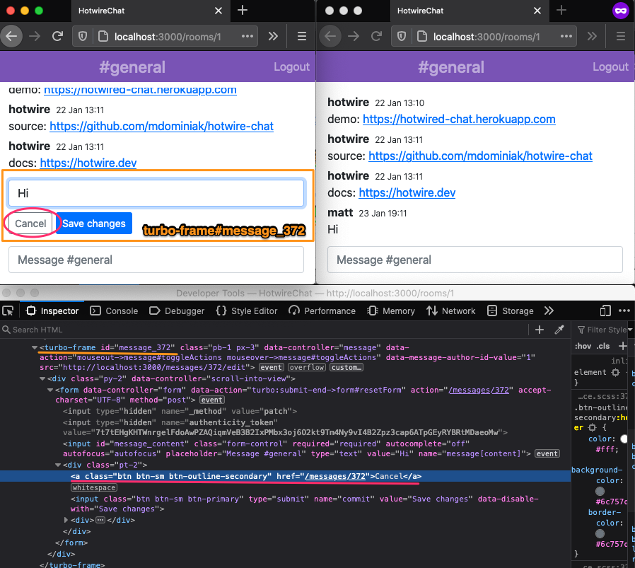
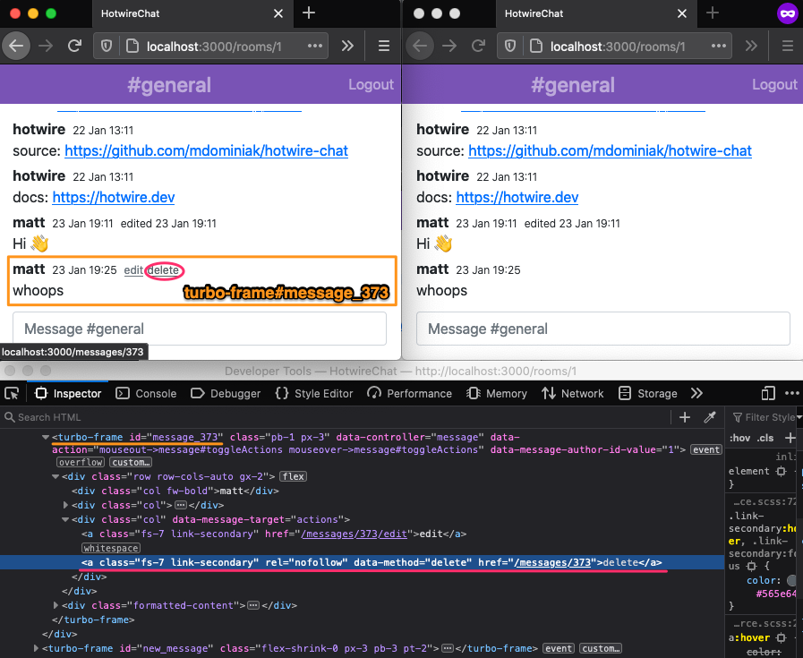
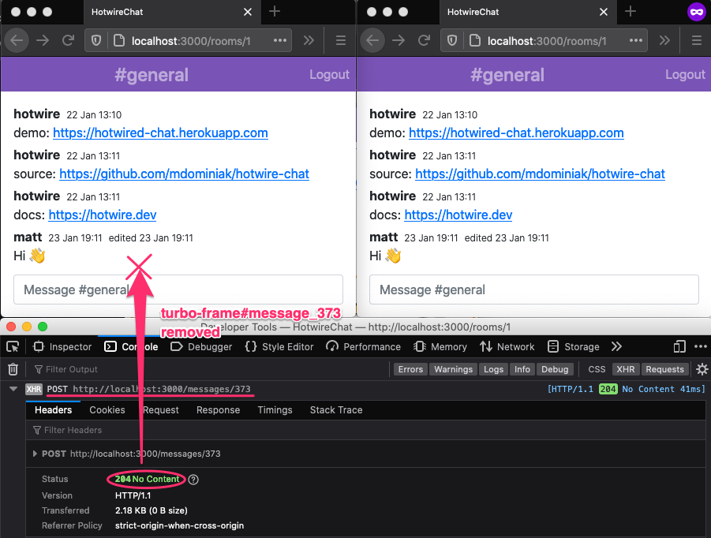
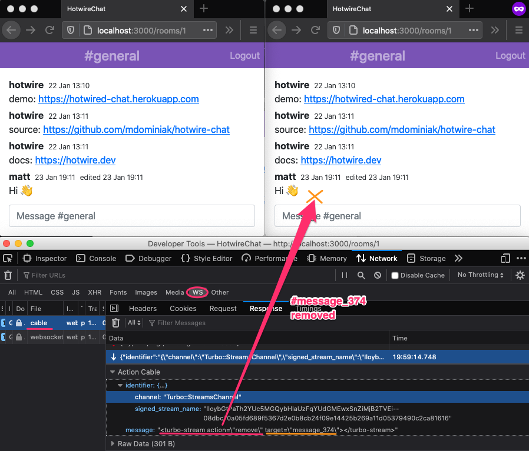

# Hotwire Chat

[](https://github.com/mdominiak/hotwire-chat/actions)

Demo chat web application built in Ruby on Rails with [Hotwire](https://hotwire.dev).<br />The demo is available at: https://hotwired-chat.herokuapp.com



## Table of Contents

* [Creating message](#creating-message)
  * [Broadcasting created message](#broadcasting-created-message)
* [Editing message](#editing-message)
* [Updating message](#updating-message)
  * [Broadcasting updated message](#broadcasting-updated-message)
* [Cancelling message edit](#cancelling-message-edit)
* [Destroying message](#destroying-message)
  * [Broadcasting destroyed message](#broadcasting-destroyed-message)
* [Caching](#caching)
* [Testing](#testing)
  * [Request specs](#request-specs)
  * [System specs](#system-specs)

## Creating message


When message form is submitted to the `POST /rooms/1/messages` endpoint, the [messages#create](app/controllers/messages_controller.rb) controller action

```ruby
# app/controllers/messages_controller.rb
class MessagesController < ApplicationController
  def create
    @message = @room.messages.new(message_params)
    @message.author = current_user

    if @message.save
      render turbo_stream: turbo_stream.append(:messages, @message) # <--
    else
      render 'new', layout: false, status: :unprocessable_entity
    end
  end
end
```

returns the following response:

```html
<turbo-frame action="append" target="messages">
  <fragment>
    <!-- app/views/messages/_message.html.erb partial -->
    <turbo-frame id="message_367" ...>
      ...
    </turbo-frame>
  </fragment>
</turbo-frame>
```

which is turbo stream action appending html fragment of newly created message to `#messages` container element. DOM updates are automatically handled by Turbo javascript on client side. The `turbo_stream` method used in the controller code is provided by [turbo-rails](https://github.com/hotwired/turbo-rails) gem.

### Broadcasting created message

When visiting a chat room page `GET /rooms/1`, the client automatically subscribes to the room channel turbo stream via ActionCable web socket. The subscription instruction is included in [rooms/show.html.erb](app/views/rooms/show.html.erb) view rendered by [rooms#show](app/controllers/rooms_controller.rb) action:

```erb
<!-- app/views/rooms/show.html.erb -->
<%= turbo_stream_from @room %>
```

Besides subscription, Turbo will automatically unsubscribe from the channel when navigating away from the room page, for example, when logging out.

All message changes (create, update, destroy) are asynchronously broadcasted to the message's room channel.

```ruby
# app/models/message.rb
class Message < ApplicationRecord
  broadcasts_to :room
end
```

On creating a new message in [messages#create](app/controllers/messages_controller.rb) controller action, turbo stream append action is broadcasted to all message's room subscribers:



The broadcasting is not bound to controller actions only. Any call to `Message.create`, `message.update`, `message.destroy` triggering ActiveRecord callbacks will result in corresponding broadcasts. Particularly, it is possible to trigger broadcasts in the rails console.

## Editing message

The edit link is nested under the message turbo frame:



When a user clicks the link, the `GET /messages/371/edit` [messages#edit](app/controllers/messages_controller.rb) endpoint returns the turbo frame with the matching identifier containing the message form:

```erb
<!-- app/views/messages/edit.html.erb -->
<%= turbo_frame_tag dom_id(@message) do %>
  <%= render 'form', message: @message %>
<% end %>
```

On receiving a response containing turbo frame with matching identifier, Turbo replaces the content of the turbo frame:



Turbo javascript automatically detects navigation within turbo frame and translates it into `fetch` request to `GET /messages/371/edit` with extra headers `Turbo-Frame: message_371` and `Accept: text/vnd.turbo-stream.html, text/html, application/xhtml+xml`. On server side, `turbo-rails` detects `Turbo-Frame` header and optimizes the response to not render application layout.

## Updating message

The message edit form is nested under the message turbo frame:



When a user submits the form, the `PATCH /messages/371` [messages#update](app/controllers/messages_controller.rb) endpoint renders the turbo frame with the matching identifier containing the html of the updated message:

```ruby
# app/controllers/messages_controller.rb
class MessagesController < ApplicationController
  def update
    if @message.update(message_params)
      render @message # renders app/views/messages/_message.html.erb partial
    else
      render 'edit', layout: false, status: :unprocessable_entity
    end
  end
end
```

```erb
<!-- app/views/messages/_message.html.erb -->
<%= turbo_frame_tag dom_id(message) do %>
  ...
<% end %>
```

On receiving the response containing turbo frame with the matching identifier, Turbo replaces the content of the turbo frame:


### Broadcasting updated message



## Cancelling message edit




## Destroying message





### Broadcasting destroyed message



## Caching

One of the key advantages of building modern web applications with Hotwire is server-side rendered views, which can be efficiently cached to reduce rendering time.

The demo app renders message content with [html-pipeline](https://github.com/gjtorikian/html-pipeline) transforming raw text with various filters like markdown, sanitization, emoji into `html_safe` formatted content:

```ruby
# app/services/html_formatter.rb
class HtmlFormatter
  class << self
    def call(content)
      pipeline.call(content)[:output].to_s.html_safe
    end

    private 

      def pipeline
        @pipeline ||= HTML::Pipeline.new([
          HTML::Pipeline::MarkdownFilter,
          HTML::Pipeline::SanitizationFilter,
          UnicodeEmojiFilter
        ])
      end
  end
end
```

The cost of rendering messages on `GET /rooms/1` page can be optimized by caching the messages:
```erb
<!-- app/views/rooms/show.html.erb -->
<%= render partial: 'messages/message', collection: @messages, cached: true %>
```

which can be observed in the rails log as follows:
```
Rendered collection of messages/_message.html.erb [4 / 100 cache hits] (Duration: 221.3ms | Allocations: 62880)
```

and on the subsequent vist:

```
Rendered collection of messages/_message.html.erb [100 / 100 cache hits] (Duration: 23.7ms | Allocations: 6292)
```

### Local time

The demo app displays the message's timestamps in local time zone. In order to keep the message partial cache friendly (independent of time zone context),
[local_time](https://github.com/basecamp/local_time) gem is used to render the timestamps in UTC on the server-side:

```erb
<!-- app/views/messages/_message.html.erb -->
<%= local_time message.created_at, format: :short, class: 'fw-light fs-7' %>
```

```html
<time datetime="2021-01-23T18:11:02Z" data-local="time" data-format="%d %b %H:%M">23 Jan 18:11</time>
```

The timestamps are then converted with [local-time](https://github.com/basecamp/local_time) javascript libary into local time zone:

```javascript
// app/javascript/application.js
import LocalTime from 'local-time'
LocalTime.start()
```

```html
<time datetime="2021-01-23T18:11:02Z" class="fw-light fs-7" data-local="time" data-format="%d %b %H:%M" title="January 23, 2021 at 7:11pm CEST" data-localized="" aria-label="23 Jan 19:11">23 Jan 19:11</time>
```

## Testing

```
bin/rspec
```

### Request specs

Turbo client-side automatically sets `Accept: text/vnd.turbo-stream.html, text/html, application/xhtml+xml` header for `fetch` requests originating from it. The header is recognized by `turbo-rails` on the server-side, so it is essential to set this header when writing request specs (aka integration tests) to simulate Turbo requests:

```ruby
# spec/requets/messages/create_spec.rb
require 'rails_helper'

describe 'messages#create', type: :request do
  let!(:user) { log_in('matt' )}
  let!(:room) { Room.create!(name: 'dev') }

  let(:message_params) { { content: 'hi!' } }
  subject { post room_messages_path(room_id: room.id), params: { message: message_params }, headers: turbo_stream_headers }

  it 'returns turbo stream appending message' do
    subject

    expect(response).to have_http_status(200)
    assert_select("turbo-stream[action='append'][target='messages']", 1)
  end
end
```

where `turbo_stream_headers` is defined as follows:

```ruby
# spec/support/turbo_stream_spec_support.rb
module TurboStreamSpecSupport
  def turbo_stream_headers(headers={})
    headers.merge('Accept': %i[ turbo_stream html ].map{ |type| Mime[type].to_s }.join(', '))
  end
end
```

Link navigations within turbo frame have the extra `Turbo-Frame: message_371` header passed by Turbo on the client-side. `turbo-rails` also recognizes this header to skip rendering of application layout, so corresponding requests specs should resemble it:

```ruby
# spec/requests/messages/edit_spec.rb
require 'rails_helper'

describe 'messages#edit', type: :request do
  let!(:author) { User.create(name: 'matt') }
  let!(:current_user) { log_in(author.name) }
  let!(:message) { Message.create!(room: Room.default_room, author: author, content: 'hello') }

  let(:headers) { turbo_stream_headers.merge('Turbo-Frame': "message_#{message.id}") }
  subject { get edit_message_path(message.id), headers: headers }

  it 'returns turbo frame with message form' do
    subject

    expect(response).to have_http_status(200)
    assert_select('body', 0)
    assert_select("turbo-frame#message_#{message.id}", 1)
    assert_select("form[action='#{message_path(message)}']", 1)
  end
end
```

See [spec/requests](spec/requests) for more examples.

### System specs

System specs (aka system tests) are `driven_by(:selenium, using: :headless_chrome)` and do not require extra configuration for turbo stream actions delivered over web socket. For example [spec/system/receive_message_spec.rb](spec/system/receive_message_spec.rb) tests user receiving turbo stream append action over the action cable web socket when message is sent by other chat participant:

```ruby
# spec/system/receive_message_spec.rb
require 'rails_helper'

describe "receive message", type: :system do
  before do
    driven_by(:selenium, using: :headless_chrome)
  end

  let!(:user) { User.create(name: 'matt') }

  it "shows message" do
    log_in(user.name)

    other_user = User.create!(name: 'adam')
    other_message = Message.create!(room: Room.default_room, author: other_user, content: 'Got it!')
    within('#messages') do
      expect(page).to have_content 'Got it!', count: 1
    end
  end
end

```

See [specs/system](spec/system) directory for more examples.
